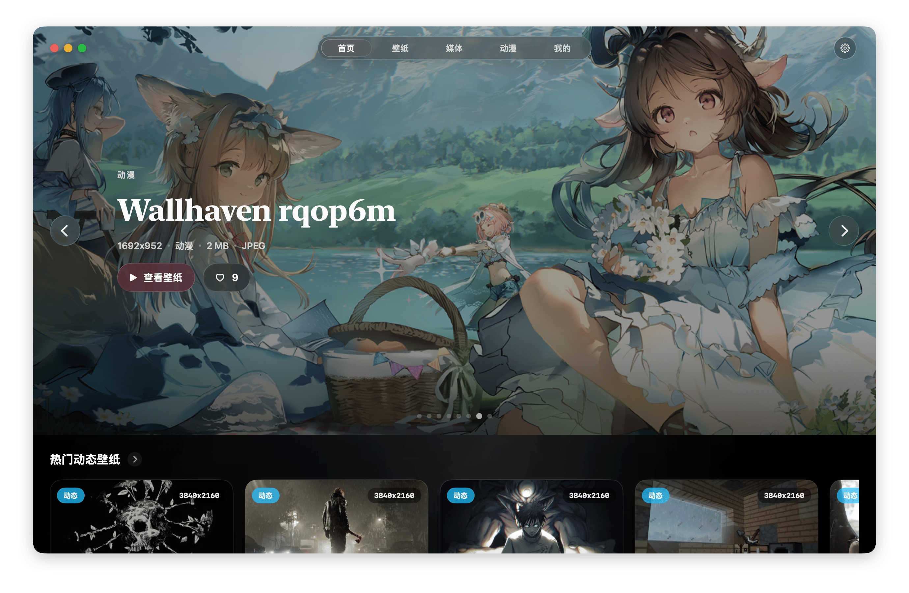
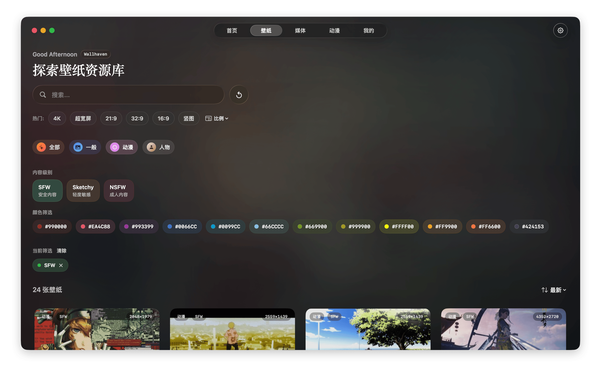
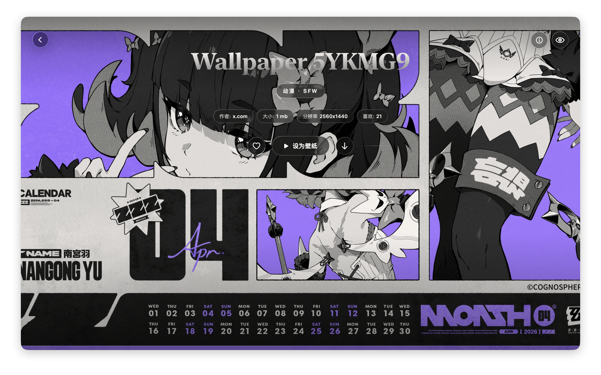
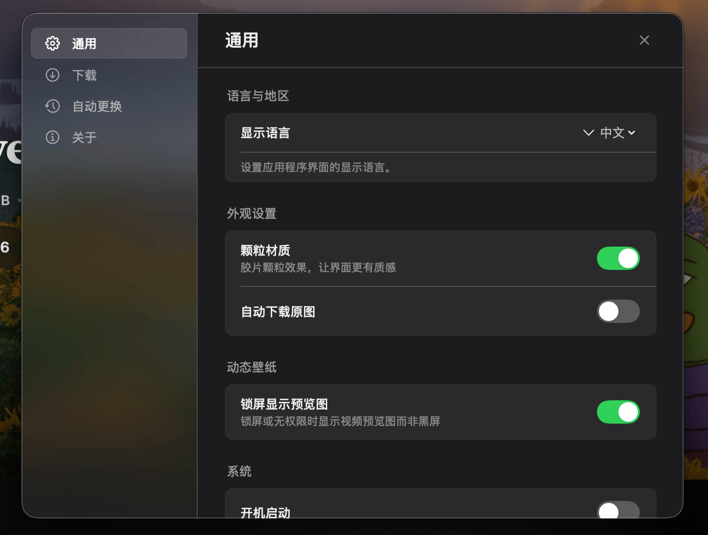
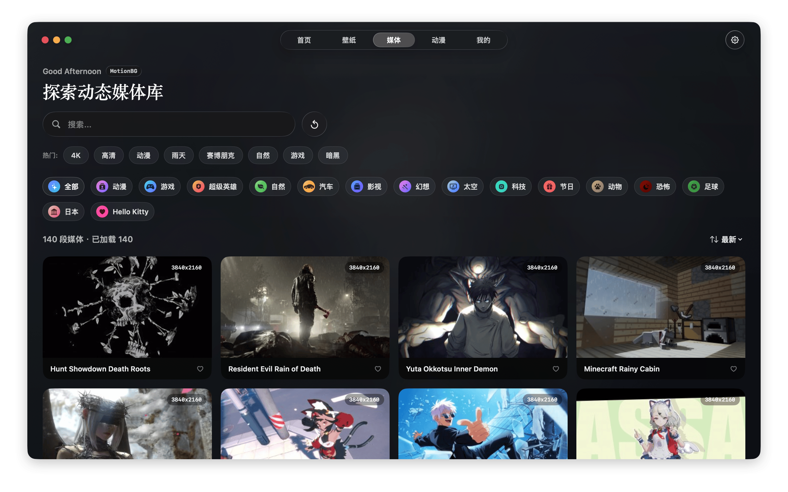
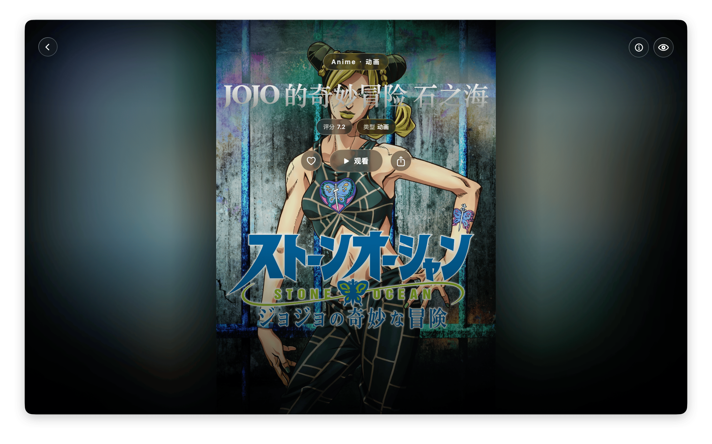
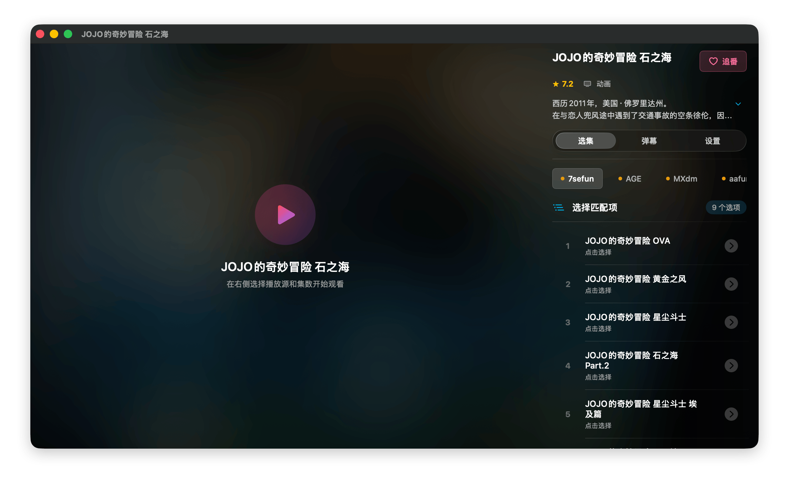

# WaifuX

<p align="center">
  <a href="README.md">🇨🇳 简体中文</a> | <a href="README.en.md">🇺🇸 English</a> | <a href="README.ja.md">🇯🇵 日本語</a>
</p>

<p align="center">
  
</p>

<p align="center">
  <samp>
    <b>Open Source All-in-One ACG App for macOS</b><br>
    <b>Static Wallpapers · Dynamic Wallpapers · Anime Videos</b><br>
    <b>Multi-source Aggregation, Full-scenario Coverage</b>
  </samp>
</p>

<p align="center">
  <a href="https://github.com/jipika/WaifuX/releases">
    
  </a>
  <a href="LICENSE">
    
  </a>
  <a href="https://github.com/jipika/WaifuX/stargazers">
    
  </a>
  <a href="https://github.com/jipika/WaifuX/forks">
    
  </a>
  <a href="https://github.com/jipika/WaifuX/releases">
    
  </a>
  <a href="https://jipika.github.io/WaifuX">
    
  </a>
</p>

---

## 📸 Preview

<table width="100%">
  <tr>
    <td width="50%"><br><p align="center">Home - Featured</p></td>
    <td width="50%"><br><p align="center">Wallpapers - Smart Filter</p></td>
  </tr>
  <tr>
    <td width="50%"><br><p align="center">Wallpaper Detail - One-click Set</p></td>
    <td width="50%"><br><p align="center">Settings - Personalization</p></td>
  </tr>
  <tr>
    <td width="50%"><br><p align="center">Live Wallpapers - MotionBG</p></td>
    <td width="50%"><br><p align="center">Anime Detail - Multi-source</p></td>
  </tr>
  <tr>
    <td width="50%"><br><p align="center">Video Player - Episode Select</p></td>
    <td width="50%"></td>
  </tr>
</table>

---

## ✨ Features

| Feature | Status | Description |
|---------|:------:|-------------|
| 🖼 **Static Wallpapers** | ✅ | Access to high-quality sources like Wallhaven with full 4K/8K resolution coverage |
| 🎬 **Dynamic Wallpapers** | ✅ | Support for MotionBGs and other dynamic background sources — bring your desktop to life |
| 📺 **Anime Videos** | ✅ | Built-in multi-source parsing engine for streaming and watching anime |
| 🔍 **Smart Search & Filter** | ✅ | Keywords, tags, categories, color, resolution — find exactly what you want |
| ⭐ **Collections** | ✅ | Save favorite wallpapers and videos to build your personal ACG library |
| ⚡️ **One-click Apply** | ✅ | Set as desktop wallpaper or dynamic desktop directly while browsing |
| 🖥️ **Multi-display Support** | ✅ | Set different wallpapers for each display — perfect for multi-monitor setups |
| 📥 **Local Data Import** | ✅ | Import local wallpaper folders for unified management of personal collections |
| 🔄 **Auto-updating Rules** | ✅ | Rule configurations loaded remotely via GitHub — quick adaptation when source sites change |
| ☁️ **Cross-device Sync** | 🚧 | Cloud sync for favorites (in development) |

---

## 📥 Installation

### Method 1: Official Website (Recommended)

👉 **[https://jipika.github.io/WaifuX](https://jipika.github.io/WaifuX)**

### Method 2: GitHub Releases

👉 **[Releases](https://github.com/jipika/WaifuX/releases)**

> ⚠️ On first launch, you may need to allow execution in "System Settings → Privacy & Security".

---

## 🌐 Network Requirements

> ⚠️ **Note for users in mainland China**

WaifuX's primary data source, [Wallhaven](https://wallhaven.cc), is hosted on overseas servers. **Direct access from mainland China may be affected by network restrictions.** If you experience issues loading content, please ensure your network can access international websites.

---

## 🛠 System Requirements

- **macOS 14.0+** (Sonoma or later)
- Supports both **Apple Silicon (M-series)** and **Intel** Macs

---

## 🔧 Rule Engine

WaifuX uses a dynamic rule system with scraping logic decoupled from the client:

- Rules are hosted in a separate repository: **[WaifuX-Profiles](https://github.com/jipika/WaifuX-Profiles)**
- Latest rules are automatically synced on app startup
- Supports custom user-imported rules
- When source site layouts change, only rules need updating — no app release required

```
App Launch → Check for Updates → Load Latest Rules → Ready to Use
                    ↑________________________|
                     (Auto-sync when remote repo updates)
```

---

## 🌍 Multi-language Support

| Language | Status |
|----------|:------:|
| 🇨🇳 简体中文 | ✅ Full Support |
| 🇺🇸 English | ✅ Full Support |
| 🇯🇵 日本語 | ✅ Full Support |

---

## ☕ Support Open Source

WaifuX is a **completely free and open-source** personal project. Developing and maintaining a native macOS application requires significant time and effort — from UI design and feature implementation to bug fixes and rule adaptations, every version is built on continuous personal dedication.

If you find WaifuX helpful, please consider supporting its continued development:

<p align="center">
  
</p>

Of course, **giving a Star ⭐️** is also greatly appreciated!

Every bit of support motivates me to keep maintaining and improving this app. Thank you for using WaifuX 💜

---

## 📄 License

This project is open-sourced under the [MIT License](LICENSE). Free to use and distribute.

---

## ⚠️ Disclaimer

WaifuX does **not store any content** itself — it acts only as an aggregation tool:

- [Wallhaven](https://wallhaven.cc) wallpapers are fetched via their public API
- [MotionBGs](https://motionbgs.com) content is configured by users themselves
- Anime video sources are provided by users
- All content copyrights belong to the original websites and authors
- Please comply with each platform's terms of service; for personal use only

---

## 🌟 Star History

<p align="center">
  
</p>

---

<p align="center">
  <samp>
    Made with 💜 by <a href="https://github.com/jipika">@jipika</a>
  </samp>
</p>

<p align="center">
  <a href="https://github.com/jipika/WaifuX/stargazers">
    
  </a>
</p>
