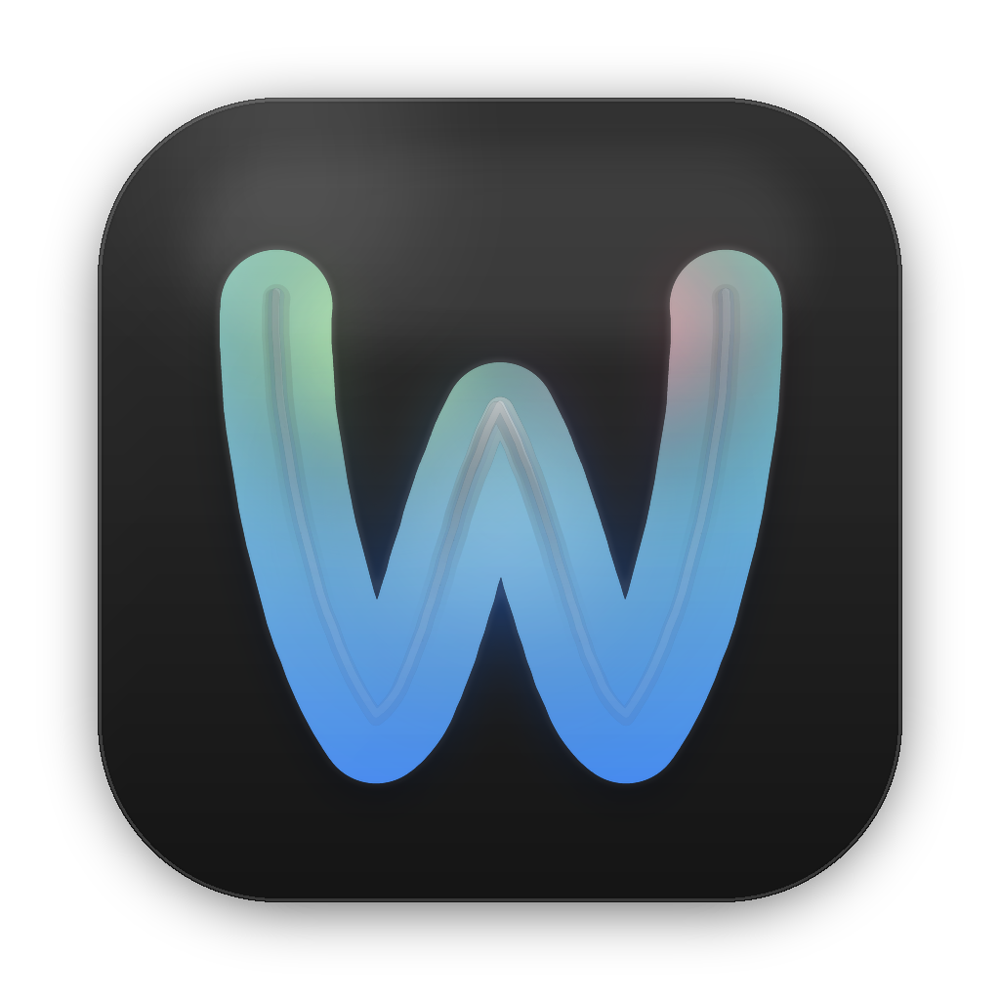

# WaifuX

<p align="center">
  
</p>

<p align="center">
  <samp>
    <b>macOS オープンソース ACG 統合アプリ</b><br>
    <b>静的壁紙 · ダイナミック壁纸 · アニメ動画</b><br>
    <b>マルチソース統合、全シナリオ対応</b>
  </samp>
</p>

<p align="center">
  <a href="https://github.com/jipika/WaifuX/releases">
    
  </a>
  <a href="LICENSE">
    
  </a>
  <a href="https://jipika.github.io/WaifuX">
    
  </a>
</p>

---

## 概要

**WaifuX** は macOS 向けのオープンソース **ACG 統合アプリケーション**です。静的壁纸、ダイナミック壁纸、アニメ動画をひとつのアプリに統合し、複数のソースからコンテンツを検索・閲覧・設定できます。

### 主な機能

| 機能 | 説明 |
|------|------|
| 🖼 **静的壁紙** | Wallhaven などの高品質ソースに対応、4K/8K フull解像度カバー |
| 🎬 **ダイナミック壁纸** | MotionBGs などの動的背景ソース対応、デスクトップを"生きている"状態に |
| 📺 **アニメ動画** | ビルトインマルチソース解析エンジンでストリーミング・視聴 |
| 🔍 **スマート検索＆フィルタ** | キーワード、タグ、カテゴリ、色、解像度 — 目的のコンテンツを素早く発見 |
| ⭐ **コレクション** | 気に入った壁纸や動画を保存して個人 ACG ライブラリーを構築 |
| ⚡️ **ワンクリック適用** | 閲覧中にそのままデスクトップ壁纸やダイナミック壁纸に設定可能 |
| 🔄 **自動更新ルール** | GitHub 経由でリモート読み込み、ソースサイトの変更にも迅速対応 |
| 🌙 **ネイティブ UI** | ダーク/ライトモード対応、macOS デザインガイドライン準拠 |

---

## 📥 インストール

### 方法1：公式ウェブサイト（推奨）

👉 **[https://jipika.github.io/WaifuX](https://jipika.github.io/WaifuX)**

### 方法2：GitHub Releases

👉 **[Releases](https://github.com/jipika/WaifuX/releases)**

> ⚠️ 初回起動時、「システム設定 → プライバシーとセキュリティ」で実行許可が必要な場合があります。

---

## 🌐 ネットワーク要件

> ⚠️ **中国本土ユーザーへのお知らせ**

WaifuX の主要データソースである [Wallhaven](https://wallhaven.cc) は海外サーバーでホストされています。**中国本土から直接アクセスできない場合があります。** コンテンツが読み込まれない場合は、海外ウェブサイトにアクセスできるネットワーク環境をご確認ください。

---

## 🛠 システム要件

- **macOS 14.0+**（Sonoma 以降）
- **Apple Silicon（Mシリーズ）** および **Intel** Mac 両方に対応

---

## 🔧 ルールエンジン

WaifuX はダイナミックルールシステムを採用しており、スクレイピングロジックとクライアントを分離しています：

- ルールは独立リポジトリで管理：**[WaifuX-Profiles](https://github.com/jipika/WaifuX-Profiles)**
- アプリ起動時に最新ルールを自動同期
- ユーザーによるカスタムルールインポートに対応
- ソースサイトのレイアウト変更時、ルールのみ更新すれば適応可能（アプリ再リリース不要）

```
アプリ起動 → 更新確認 → 最新ルール読み込み → 使用可能
                  ↑________________________|
                    （リモートリポジトリ更新時に自動同期）
```

---

## 🌍 マルチ言語サポート

| 言語 | ステータス |
|------|------|
| 🇨🇳 简体中文 | ✅ 完全対応 |
| 🇺🇸 English | ✅ 完全対応 |
| 🇯🇵 日本語 | ✅ 完全対応 |

---

## ☕ オープンソースをサポートする

WaifuX は**完全無料のオープンソース**個人プロジェクトです。ネイティブ macOS アプリケーションの開発と保守には多大な時間と労力がかかります — UI デザイン、機能実装、バグ修正、ルール適配まで、すべてのバージョンは継続的な個人的な取り組みによって作られています。

もし WaifuX がお役に立ったなら、プロジェクトの継続的な発展を支援することをぜひご検討ください：

<p align="center">
  
</p>

もちろん、**スター ⭐️ を付けるだけ**でも大きな励みになります！

すべてのサポートが、このアプリを維持・改善し続ける原動力になります。WaifuX をご利用いただきありがとうございます 💜

---

## 📄 ライセンス

本プロジェクトは [MIT License](LICENSE) の下でオープンソースとして公開されており、自由に使用・配布できます。

---

## ⚠️ 免責事項

WaifuX 自体は**コンテンツを一切保存せず**、あくまで集約ツールとして機能します：

- [Wallhaven](https://wallhaven.cc) の壁紙は公開 API 経由で取得されます
- [MotionBGs](https://motionbgs.com) のコンテンツはユーザー自身がソースアドレスを設定します
- アニメ動画ソースはユーザー自身が提供します
- 全てのコンテンツの著作権は元サイトおよび作者に帰属します
- 各プラットフォームの利用規約に従い、個人利用に限ってお使いください

---

<p align="center">
  <samp>
    Made with 💜 by <a href="https://github.com/jipika">@jipika</a>
  </samp>
</p>

<p align="center">
  <a href="https://github.com/jipika/WaifuX/stargazers">
    
  </a>
</p>
