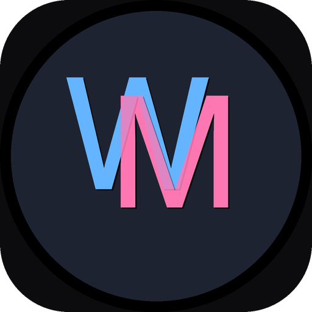

# WallHaven

<p align="center">
  
</p>

<p align="center">
  <samp>
    <b>✨ 让你的 macOS 桌面不再单调</b><br>
    <b>🎨 静态壁纸 + 动态背景 + 动漫视频</b><br>
    <b>🚀 一键切换，自动同步</b>
  </samp>
</p>

<p align="center">
  <a href="https://github.com/jipika/WallHaven/releases">
    
  </a>
  <a href="LICENSE">
    
  </a>
  <a href="https://jipika.github.io/WallHaven">
    
  </a>
</p>

---

## 🎯 这是什么？

**WallHaven** 是一款为 macOS 打造的壁纸应用——但不是那种普普通通的壁纸工具。

想象一下：早上打开电脑，桌面是 Wallhaven 的 4K 风景大片；下午摸鱼时切到 MotionBGs 的动态流水；晚上追番前再换成二次元壁纸... 是的，我们全都要！

> "你的桌面，值得更好看的衣服 👔"

---

## ✨ 功能亮点

| 功能 | 说明 |
|------|------|
| 📚 **双库支持** | Wallhaven（静态）+ MotionBGs（动态），一个应用两种体验 |
| 🎬 **动漫解析** | 内置多源动漫视频解析，追番党的桌面也要二次元 |
| 🔍 **智能搜索** | 关键词、标签、分类，快速找到心仪壁纸 |
| ⭐ **收藏管理** | 喜欢的壁纸一键收藏，打造你的专属图库 |
| ⚡️ **一键设置** | 看到喜欢的？点一下，桌面就换了 |
| 🔄 **自动同步** | GitHub 规则自动更新，源站变了我们自动适配 |
| 🖼 **全分辨率** | 4K、8K、超宽屏？统统拿下 |
| 🌙 **深色界面** | 护眼模式，深夜换壁纸也不刺眼 |

---

## 📥 下载安装

### 方式一：官网下载（推荐）
👉 **[https://jipika.github.io/WallHaven](https://jipika.github.io/WallHaven)**

### 方式二：GitHub Releases
👉 **[https://github.com/jipika/WallHaven/releases](https://github.com/jipika/WallHaven/releases)**

> ⚠️ **注意**：首次打开可能需要在「系统设置 → 隐私与安全性」中允许运行

---

## 🛠 系统要求

- **macOS 14.0+** (Sonoma 或更高版本)
- **Apple Silicon** 或 **Intel** Mac 均可

---

## 🔧 规则配置

WallHaven 的规则是**动态加载**的——这意味着即使源站改版，我们也能快速适配。

规则托管在独立仓库：**[WallHaven-Profiles](https://github.com/jipika/WallHaven-Profiles)**

- 应用启动时自动同步最新规则
- 支持手动导入自定义规则
- 规则格式简单，自己也能写

```
用户输入 GitHub URL → 自动同步规则 → 开始使用
         ↑___________________________________|
              （规则更新，自动获取）
```

---

## 🎨 使用截图

<p align="center">
  
</p>

---

## 🌍 多语言支持

| 语言 | 状态 |
|------|------|
| 🇨🇳 简体中文 | ✅ 完整支持 |
| 🇺🇸 English | ✅ Full Support |
| 🇯🇵 日本語 | ✅ 完全対応 |

---

## ☕️ 支持作者

如果 WallHaven 让你的桌面变得更好看了，可以请作者喝杯咖啡：

<p align="center">
  
</p>

或者，**点个 Star ⭐️** 也是很大的支持！

---

## 📄 开源协议

[MIT License](LICENSE) - 自由使用，欢迎贡献代码！

---

## ⚠️ 免责声明

WallHaven 只是一个**壁纸聚合工具**，本身不存储任何壁纸内容：

- [Wallhaven](https://wallhaven.cc) 壁纸通过官方 API 获取
- [MotionBGs](https://motionbgs.com) 内容由用户自行配置
- 所有壁纸版权归原网站及原作者所有
- 请遵守各网站服务条款，仅限个人使用

---

<p align="center">
  <samp>
    Made with 💜 by <a href="https://github.com/jipika">@jipika</a>
  </samp>
</p>

<p align="center">
  <a href="https://github.com/jipika/WallHaven/stargazers">
    
  </a>
</p>
